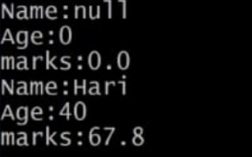
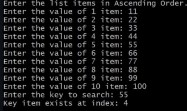

# EXPERIMENT3
## TITLE: 3a.)implement constructor overloading in java
...
class Student {

	String name;
	int age;
	double marks;

	Student() {

	}

	Student(String name, int age, double marks) {

		this.name=name;
		this.age=age;
		this.marks=marks;

	}

	void display() {

		System.out.println("Name: "+name);
		System.out.println("Age: "+age);
		System.out.println("marks: "+marks);

	}

}
class Main {

	public static void main(String args[]) {

		Student std = new Student();
		std.display();

		Student std1 = new Student("Hari", 40, 67.8);
		std1.display();

	}
}
...

# OUTPUT

## TITLE 3b.) Binary search
...
import java.util.Scanner;

class BinarySearch {

    int list[];
    int size;

    BinarySearch(int size) {
        list = new int[size];
        this.size = size;
    }

    void setList() {
        Scanner sc = new Scanner(System.in);
        System.out.println("Enter the list items in Ascending Order.");

        for (int i = 0; i < size; i++) {
            System.out.print("Enter the value of " + (i + 1) + " item: ");
            list[i] = sc.nextInt();
        }
    }

    int binarySearch(int key) {

        int low = 0;
        int high = size - 1;

        while (low <= high) {
            int mid = (low + high) / 2;

            if (list[mid] == key)
                return mid;
            else if (list[mid] < key)
                low = mid + 1;
            else
                high = mid - 1;
        }
        return -1;
    }
}
import java.util.Scanner;
class Main {

    public static void main(String args[]) {

        Scanner sc = new Scanner(System.in);

        BinarySearch bs = new BinarySearch(10);
        bs.setList();

        System.out.print("Enter the key to search: ");
        int key = sc.nextInt();

        int index = bs.binarySearch(key);

        if (index == -1)
            System.out.println("Key item does not exist");
        else
            System.out.println("Key item exists at index: " + index);
    }
}
...

## OUTPUT

## TITLE 3c.) Bubble sort
...
class BubbleSort {

	void bubbleSort(int arr[]) {

		int n = arr.length;
		int temp = 0;

		for(int i=0 ; i < n-1 ; i++) {

			for(int j=0; j<n-i-1; j++) {

				if(arr[j] > arr[j+1]) {

					temp = arr[j+1];
					arr[j+1] = arr[j];
					arr[j] = temp;

				}
			}
		}

	}

}
 import java.util.Scanner;
 class Main {
	
	public static void main(String args[]) {

		System.out.print("Enter the size of array: ");
		Scanner sc = new Scanner(System.in);
		int size = sc.nextInt();

		int integer[] = new int[size];

		for(int i = 0; i < size; i++) {

			System.out.print("Enter the value of integer at index " + (i+1) + ":"); 
			integer[i] = sc.nextInt();
		}

		BubbleSort bs = new BubbleSort();
		bs.bubbleSort(integer);

		System.out.print("The Sorted integer: ");

		for(int i = 0; i < size; i++)
		System.out.print(integer[i] + ", ");

		System.out.println("\b\b.");

	}
}
...

## OUTPUT

